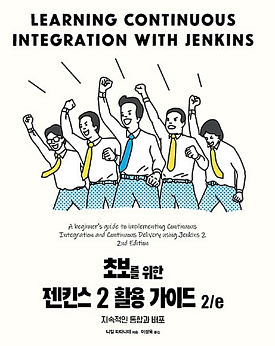

# oven

build and grow

## Jenkins Study

### Book 

### 스터디 방법 

8주 완성으로 진행하며, 매주 한 명씩 돌아가면서 수업을 리딩한다.

- 저번주 발표자의 과제 리딩 (1시간)

- 이번주 발표자의 수업 리딩(1시간)

수업 진행은 자유 방식이다.

과제는 간단하게 테스트 코드 관련 주제로 만든다.

### 스터디 시간 및 장소

매주 목요일 20:00 ~ 22:00 2시간 진행한다.

개인 일정으로 인한 요일, 시간 변경이 가능하다. 최소 일주일 전에 announce 해야한다. (물론 전원이 동의해야 한다.)

장소 : 화상회의

- 1주차 : 지승훈 (1~2장)

- 2주차 : 임재현 (3장)

- 3주차 : 김인회 (4장)

- 4주차 : 임진욱 (5장)

- 5주차 : 지승훈 (6장)

- 6주차 : 김인회 (7장)

- 7주차 : 임재현 (8장)

- 8주차 : 임진욱 (9장)

### 기타 