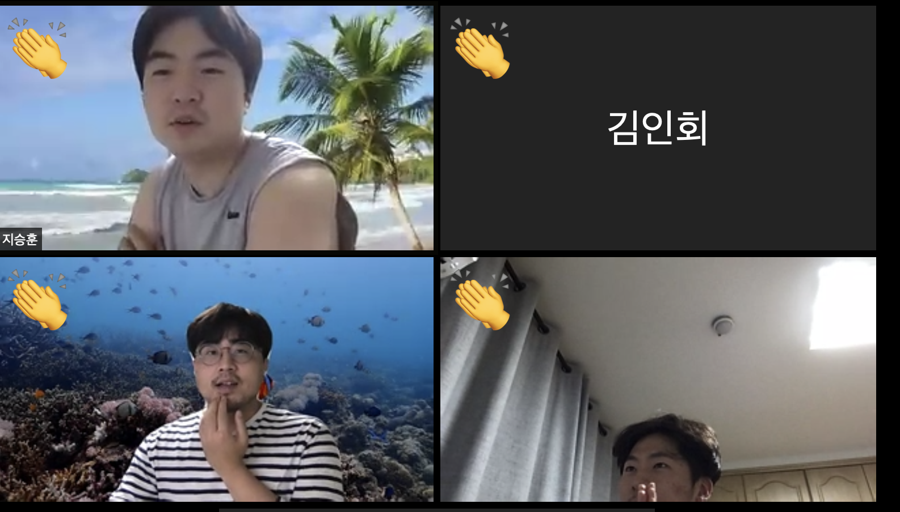

# Retrospective

### 좋았던 점 

- 실습을 해봐서 좋았다. (김인회, 임재현)

- 젠킨스의 여러 기능을 제대로 공부해서 좋았다. (임진욱)

- CI CD 등 추상적인 개념들을 제대로 학습한 것 같아서 좋았다. (지승훈)

- 8주는 아니더라도, 1주 밀린 9주안에 끝내서 좋았다. 

### 아쉬웠던 점 

- 5주차부터 실습이 어려워서 아쉬웠다. (김인회, 임재현, 지승훈)

- 회사의 다른 개발자들도 젠킨스 학습을 했으면 좋겠다. (임진욱)

### 하고 싶은 스터디 

- Spring Core (임진욱, 지승훈)

- Java, Clean Code 등의 언어 기초 및 심화 (임진욱, 지승훈)

- Shell Script(김인회)

- Spring Batch (김인회)

- Docker and Kubernetes (임재현, 임진욱)
