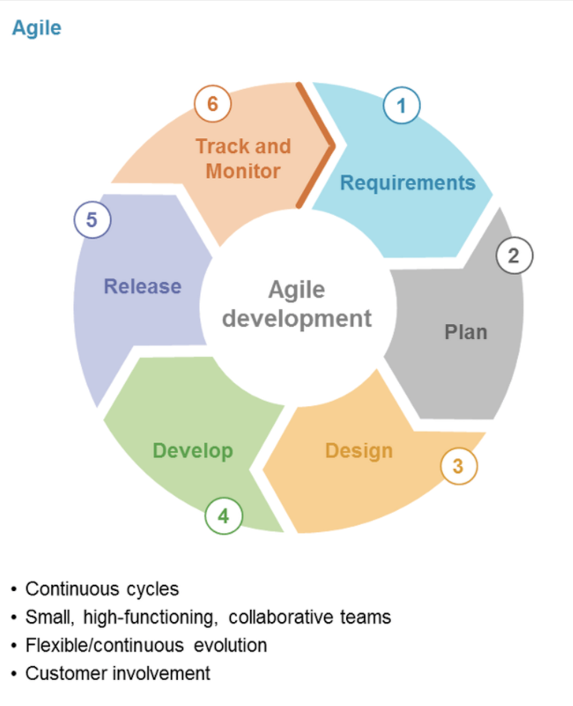
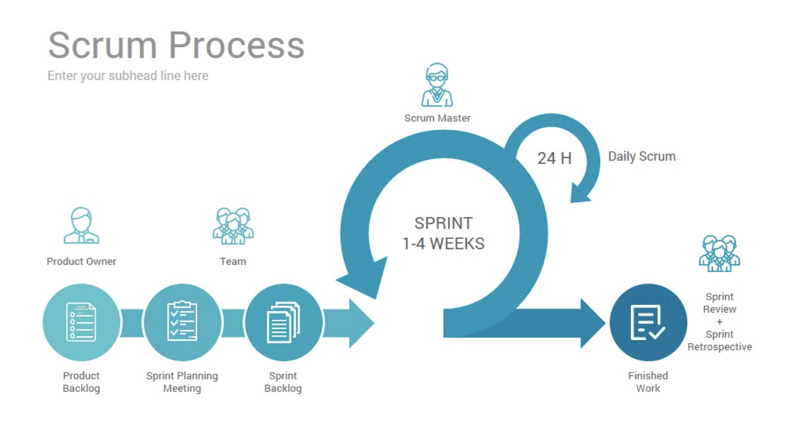
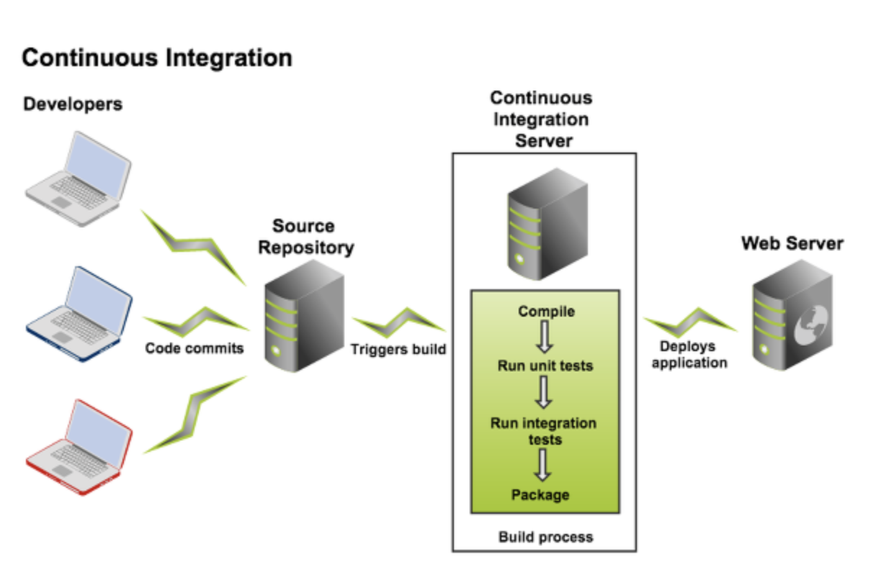
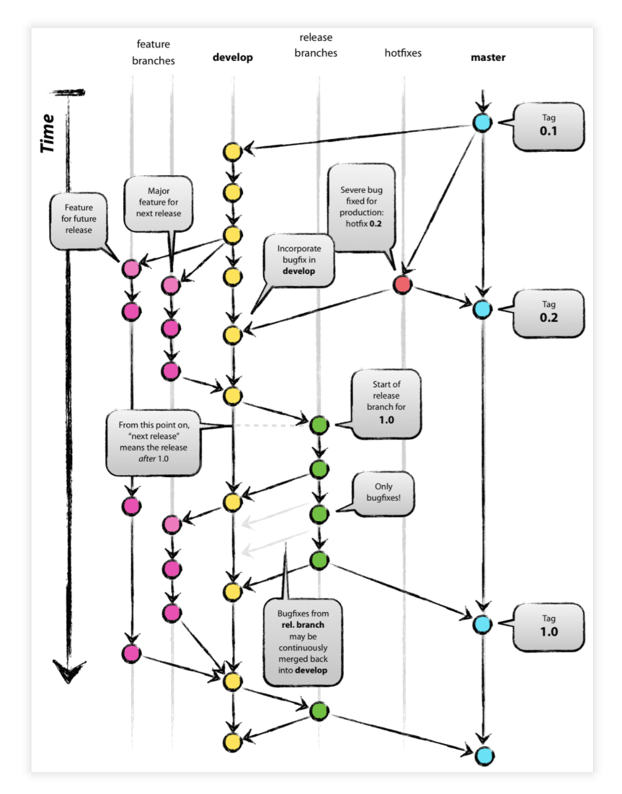

# 지속적인 통합의 개념
## 소프트웨어 개발 주기
소프트웨어 개발 주기(Software Development Life Cycle) 소프트웨어 계획, 개발, 테스트, 배포 단계를 총칭하는 뜻
### 요구사항 분석
* 비즈니스 조직(주로 업무 분석가)은 해당 프로젝트에서 달성해야 하는 요구 사항을 분석
* 요구 사항의 성질과 범위를 결정하는것도 포함
* 프로젝트의 비용과 프로젝트로 얻을 수 있는 결과가 계산되고, 프로젝트의 목표를 설정
### 설계
* 시스템 아키텍트와 설계자가 정교하게 구현해야 할 기능들을 정리하고 프로젝트 전체 계획을 만듬 >> 프로세스 그림, 인터페이스, 레이아웃, 디자인 등등 여러종유 문서가 결정됨
### 구현
* PM이 어떤일을 할지 결정해서 개발자에게 분배를 하고, 개발자들은 설계 단계에서 정의된 과제와 목표에 따라 개발을 진행함
### 테스트
* 모든 기능이 구현된 후 테스트 팀이 역할을 맡음
* 소프트웨어의 모든 모듈을 테스트 및 버그에 대한 이슈를 관리
* 테스트에 실패한 내용은 개발자에게 공유를 하여 수정하고, 테스트 완료된 코드는 프로덕션(PROD)환경에 배포한다.
### 진화
* 유지보수이며, 사용자나 고객으로부터 수집된 피드백을 분석해 개발, 테스트, 새로운 기능이나 버그를 수정하는 패치를 릴리스하는 사이클 반복
## 폭포수 모델
요구사항 분석 > 시스템 설계 > 구현 > 테스트 > 배포 > 유지 보수

### 폭포수 모델 장점
* 요구사항이 문서로 잘 정리되고 변하지 않음
* 관리자, 테스트 팀, 개발 팀, 빌드  릴리스 팀과 배포 팀을 유지할 자원이 충분히 주어짐
* 기술이 고정돼 잘 변하지 않음
* 모호한 요구사항이 존재하지 않으며, 요구사항이 요구사항 분석 단계 이후에 새로 발생하지 않음
### 폭포수 모델의 단점
* 실제로 동작하는 소프트웨어가 SDLC의 마지막에 완성이 되며, 대부분의 경우 이 결과물이 1년 전후의 시간이 지나면 더 이상 동작하지 않음
* 불확실성이 매우 큼
* 새로운 요구 사항이 자주 발생하는 프로젝트의 경우 적합하지 않음
  ex) 전자상거래
* 전제 개바리 끄난 후에야 통합이 진행되고, 그 결과 수많은 통합 이슈가 가장 마지막 단계가 되서야 발견됨
* 역추적이 불가능
* 각 단계에서 진행 현황을 알기 힘듬

## 애자일
빠르고 쉬움을 뜻하며, SOT(self organized team : 모든구성원이 참여해 문제를 정의하고 해결하는 팀을 지칭)의 협업을 통해 소프트웨어가 개발되는 방법론이며, 빠르고 유연하며 조금씩 발전되는 소프트웨어 개발을 통해 목표를 계속 수정해나가는 것

### 열두 가지 애자일 원칙

### 애자일 방법론의 동작 방식
* 소프트웨어 애플리케이션이 여러가지의 기능과 모듈로 분류하고 이런 기능이 이터레이션을 반복하며 배포
  > 계획 세우기, 요구 사항 분석, 설계, 코딩, 단위 테스트, 사용자 인수 테스트를 진행
* 요구사항 분석 및 설계보다는 하나의 이터레이션에서 기능의 개발, 테스트, 릴리스를 완료하는 것
* 이터레이션이 마무리 될때, 만들어진 기능의 데모를 진행하고 고객이 기능에 만족하면 프로덕션 서버에 반영하고 마음에 들지 않으면 해당 기능은 백로그로 들어가서 우선순위를 다시 매겨 추후 이터레이션에서 구현된다.

### 애자일 방법론의 장점
* 기능의 빠른 구현과 데모
* 적은 리소스 소요
* 팀워크 향상과 상호 교육
* 요구 사항이 자주 변경되는 프로젝트에 적합
* 최소한의 문서
* 계획이 없거나 최소한의 계획
* 동시 개발

## 스크럼 프레임워크
복잡한 소프트웨어를 개발하고 유지하는 애자일 방법론에 기반을 둔 소프트웨어 프레임워크이며, 개발팀이 어떻게 개발할지를 결정하고 직면한 문제를 개발팀이 가장 잘안다는 전제를 기반으로 한다
소프트웨어 개발 프로젝트를 위하여 고안되었지만, 소프트웨어 유지보수 팀이나 일반적인 프로젝트/프로그램 관리에서도 적용될 수 있습니다. 
 <b>=> 애자일과 스크럼은 같은 의미가 아니고 애자일 방법론 중의 하나가 스크럼</b>
### 스크럼 프레임워크의 주요 용어
* 스프린트 : 유용하고 릴리스 가능한 결과를 생산하는 데 할당된 기간을 의미
    * 이전 스프린트가 끝이나면 다음 스프린트 진행
    * 스크럼의 지식에 따라 2주부터 한달까지 변동가능
* 프로덕트 백로그 : 개발할 소프트웨어에 필요한 모든 기능의 집합
    * 고객이나 팀 구성원이 언제든지 새로운 목록을 프로덕트 백로그에 추가하거나 삭제가능
* 스프린트 백로그 : 스프린트에서 진행하기로 결정된 기능의 집합
* 인크리먼트 : 전체 프러덕트 백로그 중 이번 스프린터에서 완료된 기능과 이전 모든 스프린터에서 완료된 기능을 의미
* 개발팀 : 스프린트 마지막에 릴리스 가능한 인크리먼트를 개발하는 역할
* 프로덕트 오너 : 스크럼 팀과 그 외 사람들의 중재자
    * 스크럼 팀의 외부 담당자로서 스크럼 팀과 관련된 모든 사람과의 의사소통을 담당
* 스크럼 마스터 : 스크럼을 이해시키고 진행하는 역할
    * 스크럼의 이론과 역할 및 올바른 수행 방법을 주지시키는 방법으로 역할 수행
### 스크럼의 동작 방식

* 스프린트 계획 : 스프린트 계획은 개발자들이 주도를 하며, 정해진 시간안에 이뤄지고 계획을 세운 후에 스크럼 마스터와, 프로덕트 오너와 공유
    * 백로그중 현 스프린트에 작업될 기능 목록리스트
    * 이전 스프린트의 팀의 작업 실적
    * 개발 팀의 예상 능력
* 스프린트 주기 : 결정된 작업량에 따라 2주 ~ 한 달 사이로 정해짐
* 일간 스크럼 회의 : 스크럼 회의는 매일 진행
* 스프린트 진척 관리 : 일간 스크럼에서 스프린트의 진척을 과리하며, 스크럼 팀은 남은 작업략을 추적해 스프린트 목표 달성 가능성을 예측
* 스프린트 리뷰 : 개발 팀이 작업을 끝낸 기능의 데모를 진행

## 지속적 통합
개발자들이 빠른 주기로 작업한 내용을 통합 브랜치에 통합하고 빌드하는 개발 방식을 의미

### CI를 이용한 애자일
애자일 개발 방법론은 빠른 배포를 기반으로 하는 방법론인데, CI는 애자일에서 필요한 속도를 얻는데 도움을 줌
## CI의 구성요소
 * 버전 관리 시스템
    * 분산형 : GIT, 머큐리얼 등등..
    * 비분산형 : SVN 등등..
 *  브랜칭 전략
 
### CI도구
CI도구는 파이프라인을 생성하는 방법을 제공하며, 각 파이프라인에는 고유한 목적이 있는데 CI를 관리하거나 소작업을 관리하거나 배포를 관장
  각 작업은 연속해서 수행되는 소작업의 모음
### 자동으로 시작되는 빌드
### 코드 커버리지
### 코드 정적 분석
### 자동화된 테스트
### 바이너리 관리 도구
### 패키징 자동화

## CI 사용의 장점
* 복잡하고 어려운 통합으로부터 해방 : 폭포수 모델처럼 통합을 자주 하지 않으면 머지 지옥에 빠질수 있으나, 
기능 브랜치에 올려진 모든 커밋을 통합하고 테스트 하면, CI도구가 통합 이슈를 즉시 알려줌
* 메트릭 : 젠킨스, 소나큐브, 아티팩토리, 깃허브 같은 도구를 통해서 작업 기간동안의 추세 및 기록을 보여줌
* 이슈의 조기 발견 : 머지이슈 및 통합이슈를 즉시 발견할수 있고, 빌드 실패 즉시 알람을 통해 알 수 있음
* 빠른 개발 : 빌드, 테스트, 소스코드 통합을 자동을 하는 환경이 되면서, 빠른 개발이 가능s
* 기능추가에 집중하기

